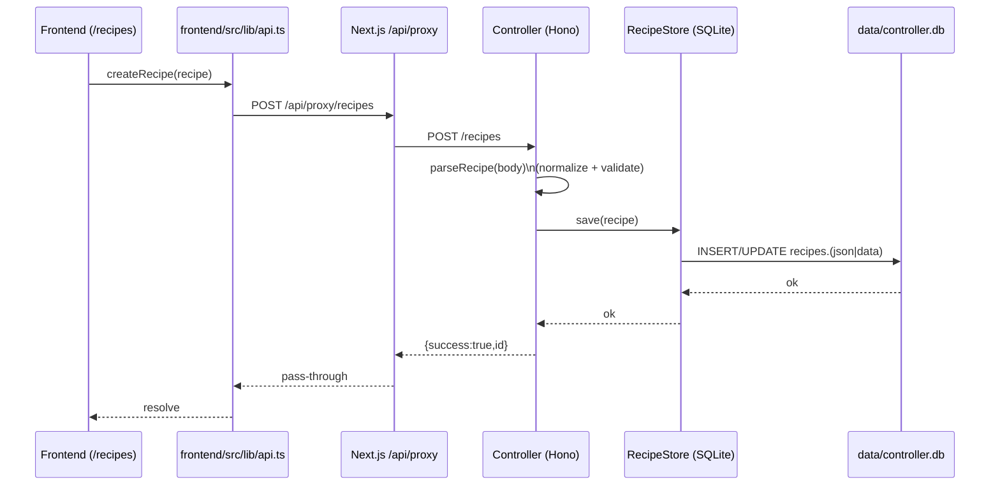
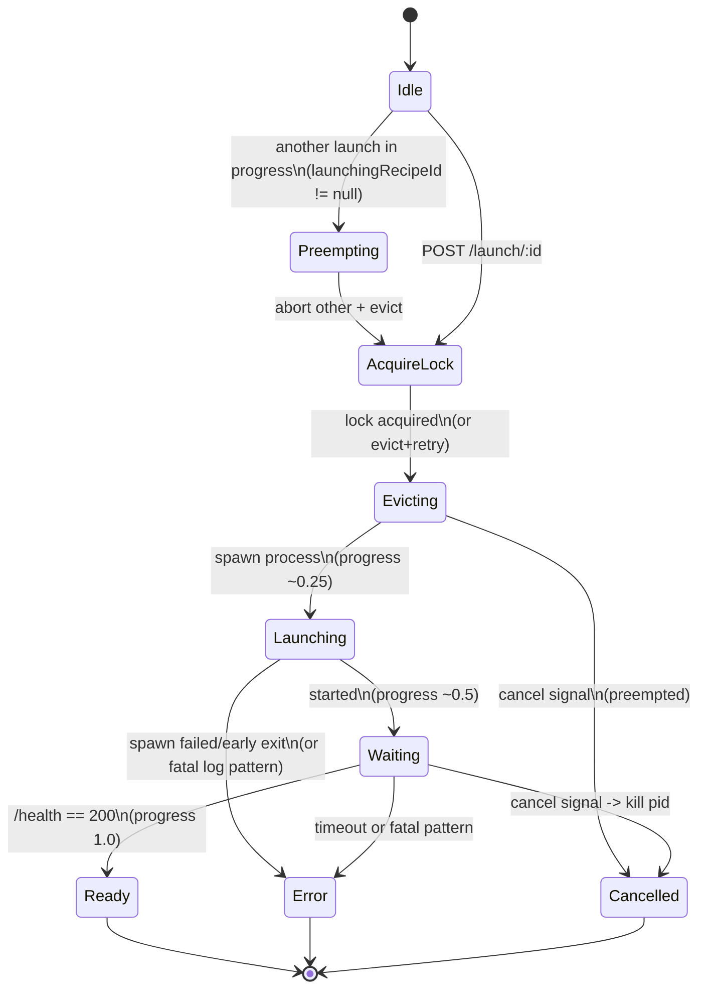
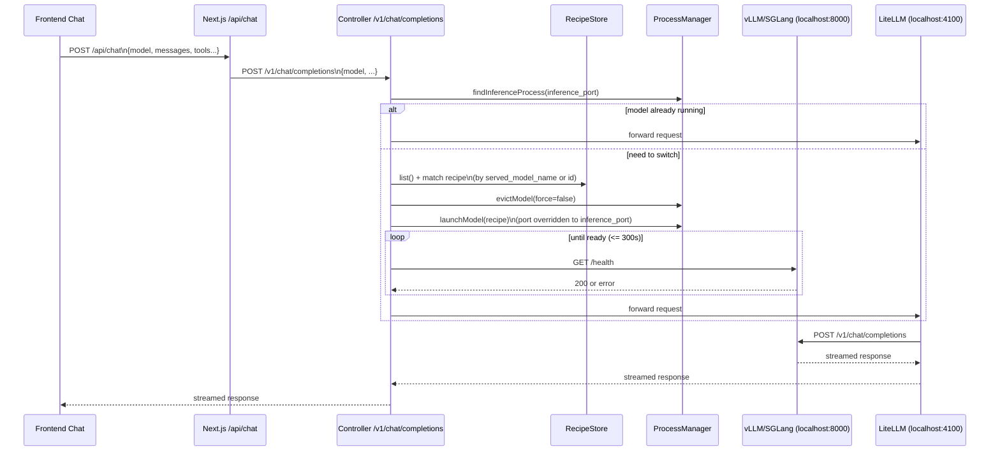

# Recipe System (Frontend <-> Controller <-> Database)

This document maps the end-to-end "recipe system" in this repo: where recipes are stored, how they are edited in the UI, how the controller turns them into actual startup commands, and how model switching works via `/launch/*` and `/v1/chat/completions`.

## Scope / Terminology

- **Recipe**: A persisted model launch configuration (vLLM/SGLang CLI flags + env vars + metadata).
- **Controller**: Bun + Hono service in `controller/` (entry: `controller/src/main.ts`).
- **Frontend**: Next.js app in `frontend/`.
- **DB**: SQLite (primarily `data/controller.db` for recipes/metrics/mcp; `data/chats.db` for chat storage).
- **Inference port**: The single port that the controller targets for the running backend (`VLLM_STUDIO_INFERENCE_PORT`, default `8000`).

---

## 1) Where Recipes Live (DB Files + Tables)

### 1.1 Controller DB Path Resolution

Controller config is built in `controller/src/config/env.ts`:

- `VLLM_STUDIO_DB_PATH` (default: `data/controller.db` when running from repo root)
- `VLLM_STUDIO_DATA_DIR` (default: `data/`)

The dependency container `controller/src/app-context.ts` constructs:

- `RecipeStore(dbPath)` where `dbPath = resolve(config.db_path)`
- `ChatStore(resolve(config.data_dir, "chats.db"))`

So, by default:

- Recipes are stored in: `data/controller.db` (table: `recipes`)
- Chats are stored in: `data/chats.db` (tables: `chat_sessions`, `chat_messages`)

Note: `data/controller.db` may also contain other tables (e.g. `mcp_servers`, `peak_metrics`, `lifetime_metrics`, etc.)
and in some environments may even contain legacy chat tables. The controller's *current* wiring uses `data/chats.db` for
chats and `data/controller.db` for recipes/metrics/mcp.

There is also a legacy/standalone recipes DB in this repo:

- `data/recipes.db` (table: `recipes` with a `data` column)

`RecipeStore` supports both schemas by choosing either `recipes.json` or `recipes.data` depending on which column exists (`controller/src/stores/recipe-store.ts`).

### 1.2 `recipes` Table Schema(s)

Observed in `data/controller.db` (current environment):

```sql
CREATE TABLE recipes (
  id TEXT PRIMARY KEY,
  json TEXT NOT NULL,
  created_at TEXT NOT NULL,
  updated_at TEXT NOT NULL,
  model_key TEXT,
  is_default INTEGER
);
```

Notes:

- **The controller code only reads/writes the `id` and JSON payload column** (`json` or `data`). Columns like `model_key` / `is_default` exist but are not referenced by `RecipeStore` today.
- JSON is stored as `TEXT` and parsed/validated on read via `parseRecipe(...)`.

Legacy schema (as found in `data/recipes.db` and also what `RecipeStore` will create if the table is missing):

```sql
CREATE TABLE recipes (
  id TEXT PRIMARY KEY,
  data TEXT NOT NULL,
  created_at TEXT DEFAULT CURRENT_TIMESTAMP,
  updated_at TEXT DEFAULT CURRENT_TIMESTAMP
);
```

### 1.3 RecipeStore Behavior (SQLite Layer)

Implementation: `controller/src/stores/recipe-store.ts`

- **list()**: `SELECT json|data FROM recipes ORDER BY id` -> `JSON.parse` -> `parseRecipe` -> returns `Recipe[]`
  - Invalid rows are skipped (parse exceptions are swallowed).
- **get(id)**: `SELECT json|data FROM recipes WHERE id=?` -> parse -> `Recipe | null`
- **save(recipe)**: `INSERT ... ON CONFLICT(id) DO UPDATE ...`
  - In `json` mode: sets `created_at` and `updated_at` explicitly to `CURRENT_TIMESTAMP`
  - In `data` mode: relies on `created_at` default, updates `updated_at`
- **delete(id)**: deletes by primary key and returns a boolean.

---

## 2) The Canonical Recipe Data Model (Controller)

### 2.1 Controller "Recipe" Type (Runtime Truth)

Type: `controller/src/types/models.ts` (`export interface Recipe`)

Validation/normalization: `controller/src/stores/recipe-serializer.ts` (`parseRecipe`)

Important fields (as stored in DB, after normalization):

```ts
// This is the controller-side shape that gets JSON.stringify()'d into SQLite.
interface Recipe {
  id: string;
  name: string;
  model_path: string;
  backend: "vllm" | "sglang" | "transformers";

  // Launch settings -> CLI flags.
  host: string;               // default "0.0.0.0"
  port: number;               // default 8000 (but see port override at launch time)
  served_model_name: string | null;

  tensor_parallel_size: number;    // default 1
  pipeline_parallel_size: number;  // default 1
  max_model_len: number;           // default 32768
  gpu_memory_utilization: number;  // default 0.9
  kv_cache_dtype: string;          // default "auto"
  max_num_seqs: number;            // default 256
  trust_remote_code: boolean;      // default true

  tool_call_parser: string | null;
  reasoning_parser: string | null;
  enable_auto_tool_choice: boolean; // default false (but see build behavior)

  quantization: string | null;
  dtype: string | null;

  python_path: string | null;        // optional

  // Non-flag concerns.
  env_vars: Record<string, string> | null;
  extra_args: Record<string, unknown>; // "everything else"

  // "Thinking" related knobs (used elsewhere; not used by vLLM command builder directly).
  max_thinking_tokens: number | null;
  thinking_mode: string; // default "conservative"
}
```

### 2.2 Input Normalization Rules (What Happens When You POST/PUT)

`parseRecipe(raw)` does a normalization pass before Zod validation (`normalizeRecipeInput`):

- Legacy key support:
  - `engine` -> `backend`
  - `tp` -> `tensor_parallel_size` (if tensor_parallel_size missing)
  - `pp` -> `pipeline_parallel_size` (if pipeline_parallel_size missing)
- Environment variable support:
  - Accepts `env_vars` at top-level.
  - Also accepts `env_vars` / `env-vars` / `envVars` inside `extra_args` and hoists it into the top-level `env_vars`.
- **Unknown top-level keys are moved into `extra_args`** (except for a short allowlist like `tp`/`pp`, which are intentionally dropped after being used for normalization).

This means the recipe system is effectively:

- a small "first-class" schema for commonly-used flags, plus
- an unbounded `extra_args` bag that can represent almost any vLLM CLI flag.

---

## 3) How a Recipe Becomes an Actual Startup Command

### 3.1 Controller Command Builder (Source of Truth)

vLLM: `controller/src/services/backends.ts` -> `buildVllmCommand(recipe)`

SGLang: `controller/src/services/backends.ts` -> `buildSglangCommand(recipe, config)`

Both ultimately return **an argv array** (not a single string), e.g.:

```ts
["vllm", "serve", "/path/to/model", "--host", "0.0.0.0", "--port", "8000", ...]
```

#### vLLM flags emitted from first-class recipe fields

`buildVllmCommand` always/conditionally adds:

- `vllm serve <model_path>`
- `--host <recipe.host>`
- `--port <recipe.port>`
- `--served-model-name <recipe.served_model_name>` (if set)
- `--tensor-parallel-size <tensor_parallel_size>` (if > 1)
- `--pipeline-parallel-size <pipeline_parallel_size>` (if > 1)
- `--max-model-len <max_model_len>` (always)
- `--gpu-memory-utilization <gpu_memory_utilization>` (always)
- `--max-num-seqs <max_num_seqs>` (always)
- `--kv-cache-dtype <kv_cache_dtype>` (if not `"auto"`)
- `--trust-remote-code` (if `trust_remote_code` true)
- Tool calling:
  - If `recipe.tool_call_parser` is set OR a default parser is auto-detected:
    - `--tool-call-parser <parser>`
    - `--enable-auto-tool-choice` (always paired with tool-call-parser in the builder)
- Reasoning:
  - If `recipe.reasoning_parser` is set OR a default parser is auto-detected:
    - `--reasoning-parser <parser>`
- `--quantization <quantization>` (if set)
- `--dtype <dtype>` (if set)

Auto-detection helpers:

- `getDefaultToolCallParser(recipe)`
- `getDefaultReasoningParser(recipe)`

Both are in `controller/src/services/backends.ts` and are based on substring matching of
`(recipe.served_model_name || recipe.model_path).toLowerCase()`.

#### Extra flags via `extra_args`

After building the base argv, the controller appends everything from `recipe.extra_args`
using `appendExtraArguments(command, recipe.extra_args)`.

Key behaviors in `appendExtraArguments` (same file):

- Internal-only keys are ignored (not turned into flags):
  - `venv_path`, `env_vars`, `cuda_visible_devices`, `description`, `tags`, `status`
- Flags are rendered as:
  - `--${key}` where underscores in the key become dashes
  - If `value === true`: emit flag with no value (`--flag`)
  - If array/object: JSON-stringify the value (`--flag '{"k":1}'`)
  - If string for a JSON-like key (e.g. `speculative_config` / `default_chat_template_kwargs`):
    - attempts to parse and re-stringify as normalized JSON

This is how your example maps cleanly:

```bash
CUDA_VISIBLE_DEVICES=0,1,2,3,4,5 \
vllm serve /mnt/llm_models/Qwen3-VL-32B-Thinking \
  --tensor-parallel-size 2 \
  --pipeline-parallel-size 3 \
  --dtype float16 \
  --max-model-len 120000 \
  --block-size 16 \
  --max-num-seqs 4 \
  --max-num-batched-tokens 6144 \
  --gpu-memory-utilization 0.92 \
  --swap-space 32 \
  --reasoning-parser qwen3 \
  --enable-auto-tool-choice \
  --tool-call-parser hermes \
  --disable-custom-all-reduce \
  --host 0.0.0.0 \
  --port 8000
```

Suggested corresponding recipe JSON shape (conceptually):

```json
{
  "id": "qwen3-vl-32b-thinking",
  "name": "Qwen3-VL-32B-Thinking",
  "backend": "vllm",
  "model_path": "/mnt/llm_models/Qwen3-VL-32B-Thinking",

  "tensor_parallel_size": 2,
  "pipeline_parallel_size": 3,
  "dtype": "float16",
  "max_model_len": 120000,
  "max_num_seqs": 4,
  "gpu_memory_utilization": 0.92,
  "tool_call_parser": "hermes",
  "reasoning_parser": "qwen3",
  "enable_auto_tool_choice": true,

  "host": "0.0.0.0",
  "port": 8000,

  "extra_args": {
    "cuda_visible_devices": "0,1,2,3,4,5",
    "block-size": 16,
    "max-num-batched-tokens": 6144,
    "swap-space": 32,
    "disable-custom-all-reduce": true
  }
}
```

### 3.2 Environment Variables for the Spawned Process

Environment handling is separate from argv:

- `controller/src/services/process-utilities.ts` -> `buildEnvironment(recipe)`

It builds env from:

- `process.env` (inherits controller environment)
- `recipe.env_vars` (top-level)
- `recipe.extra_args.env_vars` / `env-vars` / `envVars`
- `recipe.extra_args.cuda_visible_devices` (or `CUDA_VISIBLE_DEVICES`)

So `CUDA_VISIBLE_DEVICES=...` in your command maps to **env**, not argv.

### 3.3 Port Override (Critical Detail)

Even though recipes have a `port` field, the controller does **not** launch per-recipe ports today.

In `controller/src/services/process-manager.ts` (`launchModel`):

- The recipe passed to the command builder is overwritten:
  - `port: config.inference_port`

So **the actual spawned model always binds to `VLLM_STUDIO_INFERENCE_PORT`** (default `8000`).

---

## 4) Controller API: CRUD + Launch/Evict + Chat Switching

### 4.1 Recipe CRUD Endpoints

Routes: `controller/src/routes/lifecycle.ts`

- `GET /recipes`
  - Returns all recipes with an added `status` field:
    - `running` / `starting` / `stopped`
  - Status is derived from:
    - `launchState.getLaunchingRecipeId()` and
    - `processManager.findInferenceProcess(inference_port)`
- `GET /recipes/:recipeId`
  - Returns the recipe with `tp` / `pp` aliases (and removes `tensor_parallel_size` / `pipeline_parallel_size`).
- `POST /recipes` -> validate via `parseRecipe` -> `RecipeStore.save`
- `PUT /recipes/:recipeId` -> validate via `parseRecipe({ ...body, id: recipeId })` -> `RecipeStore.save`
- `DELETE /recipes/:recipeId` -> `RecipeStore.delete`

### 4.2 Lifecycle Endpoints (Direct Model Switching)

Also in `controller/src/routes/lifecycle.ts`:

- `POST /launch/:recipeId`
- `POST /launch/:recipeId/cancel`
- `POST /evict?force=<bool>`
- `GET /wait-ready?timeout=<seconds>`

The `/launch/:recipeId` endpoint is the "state machine" that:

- serializes launch attempts through a lock,
- evicts the previous model,
- spawns the new model,
- polls `/health`,
- emits SSE progress events.

### 4.3 Chat-Completions Switching (Model Auto-Switch)

Route: `controller/src/routes/proxy.ts` -> `POST /v1/chat/completions`

Before forwarding the request to LiteLLM, it:

1. Parses the request body and extracts `model` and `stream`.
2. If `model` is present:
   - Checks the currently running inference process (by port).
   - If the running model does not match the requested model name:
     - Finds a matching recipe by:
       - `recipe.served_model_name` (case-insensitive) OR
       - `recipe.id` (case-insensitive)
     - Evicts the current model
     - Launches the recipe (same command builder described above)
     - Polls `/health` until ready (up to 300s)
3. Forwards the chat completion request to LiteLLM:
   - `http://localhost:4100/v1/chat/completions`

This is why "just calling chat completions with a model name" can implicitly trigger recipe-based model switching.

### 4.4 `/v1/models` (How Recipes Become "Models" for OpenAI Clients)

Routes: `controller/src/routes/models.ts`

- `GET /v1/models`
  - Returns an OpenAI-compatible model list derived from **recipes**.
  - Each recipe becomes a model with:
    - `id = recipe.served_model_name ?? recipe.id`
    - `active = true` if it appears to match the currently running inference process
    - `max_model_len` from the recipe (or, if the backend is reachable, from the live `/v1/models` response)
- `GET /v1/models/:modelId`
  - Looks up a recipe by `served_model_name == modelId` OR `id == modelId`
  - Returns an OpenAI-compatible model object

This matters because:

- Frontend/clients typically populate model pickers from `/v1/models`.
- The value you send as `model` in `/v1/chat/completions` is the same value the controller uses
  to find a matching recipe for auto-switching.

---

## 5) Frontend: Recipe List + Editor + How It Talks to the Controller

### 5.1 Network Path (Browser -> Next.js -> Controller)

Most browser API calls go through a Next.js proxy:

- Next.js proxy route: `frontend/src/app/api/proxy/[...path]/route.ts`
- Client API client: `frontend/src/lib/api.ts` (baseUrl `/api/proxy` in-browser)

So, a browser call like `api.getRecipes()` becomes:

1. Browser -> `GET /api/proxy/recipes`
2. Next.js proxy -> `GET ${BACKEND_URL}/recipes` (+ Authorization if configured)
3. Controller -> returns JSON

SSE (`/events`) is also proxied and streamed through this route.

### 5.2 Recipes UI Pages

- Dashboard quick launch: `frontend/src/app/page.tsx`
  - Calls `api.switchModel(recipeId, true)` -> `POST /launch/:recipeId?force=true`
- Full recipes list/editor: `frontend/src/app/recipes/page.tsx`
  - Lists recipes with search + pinning (pinned stored in localStorage only)
  - Launch:
    - Calls `fetch("/api/proxy/launch/:id", {method:"POST"})` but aborts after 5s (fire-and-forget)
  - Edit/Create:
    - `api.createRecipe(...)` / `api.updateRecipe(...)` / `api.deleteRecipe(...)`

### 5.3 Realtime Updates (Launch Progress)

Frontend hook: `frontend/src/hooks/use-realtime-status.ts`

- Connects EventSource to `/api/proxy/events`
- Listens for `event: launch_progress`
- Updates UI (progress banner / toast)

Controller SSE source:

- `controller/src/routes/logs.ts` -> `GET /events`
- Backed by `controller/src/services/event-manager.ts`
- `/launch/:id` publishes progress via `eventManager.publishLaunchProgress(...)`

### 5.4 Two Editing Modes (Form vs Command) - Current Behavior

Recipe editor drawer: `frontend/src/app/recipes/page.tsx` (`RecipeModal`)

- **Form mode**: inputs/selects toggle a limited set of fields.
- **Command mode**:
  - Renders a command preview string using an internal helper `generateCommand(recipe)`
  - Allows editing the text in a textarea
  - BUT: the edited command is currently held only in local component state (`editedCommand`)
    and is **not** transformed back into recipe fields or persisted when saving.

So today, command mode is effectively a **preview** (and the note about "used as-is" does not match the current persistence/launch implementation).

Also note: the command preview function in the frontend is not the controller's command builder.
The actual argv used for launching comes from:

- `controller/src/services/backends.ts` (and `appendExtraArguments(...)`)

---

## 6) State Machines (Mermaid)

### 6.1 Recipe CRUD (Sequence)



### 6.2 `/launch/:recipeId` Model Launch State Machine



Implementation anchors:

- Route/state machine: `controller/src/routes/lifecycle.ts` (`POST /launch/:recipeId`)
- Spawn: `controller/src/services/process-manager.ts` (`launchModel`)
- Log file: `/tmp/vllm_<recipeId>.log`
- Readiness probe: `GET http://localhost:<inference_port>/health`
- SSE progress events: `controller/src/services/event-manager.ts`

### 6.3 Chat-Completions Auto-Switch (Sequence)



---

## 7) Current Gaps / Gotchas (Explains "Editing Feels Hard")

These are all direct consequences of the current code paths above:

1. **Port in recipes is not honored at launch time**
   - The controller forces `recipe.port = VLLM_STUDIO_INFERENCE_PORT` in `launchModel(...)`.
2. **Many vLLM options in the frontend type are not first-class in the controller schema**
   - The controller will move unknown fields into `extra_args`.
   - If the frontend reads/writes those fields at top-level (instead of `extra_args`), the UI will not round-trip cleanly.
3. **Frontend "Command mode" is not currently a true edit path**
   - The edited command text is not parsed back into recipe fields or persisted.
   - The preview command is generated by frontend code, not by the controller command builder.
4. **Tool-call / reasoning defaults can surprise**
   - The controller can auto-inject parsers based on model name.
   - `--enable-auto-tool-choice` is coupled to tool-call-parser in the controller builder (even if `enable_auto_tool_choice` is false).
5. **Two independent locks exist**
   - `/launch/:id` uses a lock in `controller/src/routes/lifecycle.ts`.
   - `/v1/chat/completions` uses a separate lock in `controller/src/routes/proxy.ts`.
   - They do not coordinate with each other.

---

## 8) Quick File/Module Index (Recipe System)

Controller:

- Config: `controller/src/config/env.ts`
- App wiring: `controller/src/main.ts`, `controller/src/http/app.ts`, `controller/src/app-context.ts`
- Recipe model + parsing:
  - `controller/src/types/models.ts` (Recipe interface)
  - `controller/src/stores/recipe-serializer.ts` (parseRecipe + normalization)
  - `controller/src/stores/recipe-store.ts` (SQLite)
- Launch + process:
  - `controller/src/routes/lifecycle.ts` (`/recipes/*`, `/launch/*`, `/evict`)
  - `controller/src/services/process-manager.ts` (spawn/evict/find)
  - `controller/src/services/backends.ts` (argv builder)
  - `controller/src/services/process-utilities.ts` (env + ps helpers)
- SSE + logs:
  - `controller/src/services/event-manager.ts`
  - `controller/src/routes/logs.ts` (`/events`, `/logs/*`)
- Chat switching:
  - `controller/src/routes/proxy.ts` (`/v1/chat/completions`)

Frontend:

- API client + proxy:
  - `frontend/src/lib/api.ts`
  - `frontend/src/app/api/proxy/[...path]/route.ts`
- Recipes UI:
  - `frontend/src/app/recipes/page.tsx`
- Realtime SSE:
  - `frontend/src/hooks/use-realtime-status.ts`
- Chat endpoint:
  - `frontend/src/app/api/chat/route.ts`
